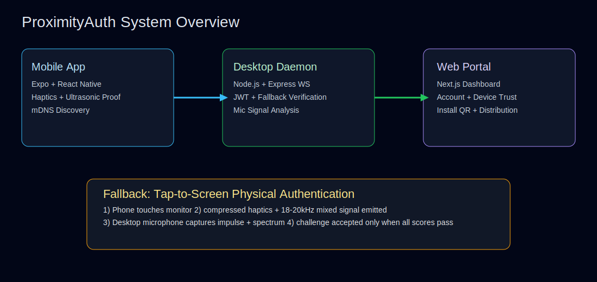
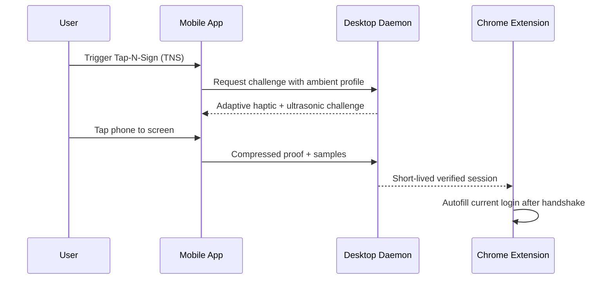

# ProximityAuth Monorepo


[](https://ncom.co/proximityauth?utm_source=chrome-extension&utm_medium=badge&utm_campaign=repo-readme)
[](https://testflight.apple.com/join/proximityauth?utm_source=github&utm_medium=readme_badge&utm_campaign=ios_testflight)

ProximityAuth is a proximity-based authentication system that combines identity verification with **physical-nearby assurance**.

## System visualization





## Why this is different from OAuth-only authentication

OAuth validates authorization grants, but does not prove physical-nearby presence at sign-in. ProximityAuth adds near-field assurance.

| Capability | OAuth-only | ProximityAuth |
|---|---|---|
| User identity & token exchange | ✅ | ✅ |
| Device proximity assurance | ❌ | ✅ |
| Tap-to-screen fallback for older devices | ❌ | ✅ |
| Ultrasonic + haptic anti-relay signal checks | ❌ | ✅ |
| Ambient-noise adaptive haptics | ❌ | ✅ |
| Extension-first autofill after physical handshake | ❌ | ✅ |

## Tap-N-Sign (TNS) improvements

- **Adaptive vibration strength:** daemon computes `suggestedIntensityScale` from ambient microphone RMS/peak and returns louder challenges for noisy environments.
- **Noise filtering:** verification applies noise gate + simple ultrasonic band filtering before spectral scoring.
- **Extension-first workflow:** users can authenticate from extension popup without opening portal first.
- **Handshake-gated autofill:** extension autofill is unlocked only after short-lived verified local handshake.

## Repository layout

- `apps/web`: Next.js 14 portal.
- `apps/daemon`: Node.js 20 daemon (mDNS, fallback challenge, verification, extension sessions).
- `apps/mobile`: Expo React Native app (adaptive fallback proof generation).
- `extensions/chrome-proximityauth`: TNS extension with handshake and autofill triggers.
- `.docs`: documentation + diagrams.
- `.website`: static website payload.
- `.Apps`: mobile artifact buckets (`.Apps/iOS`, `.Apps/Android`).

## Binary-file PR issue note

If PR creation fails with **"Binary files are not supported"**, avoid committing binary icons/assets in extension folders. This repo now uses text-only extension assets to keep PR generation stable.

## Run locally

```bash
npm install --ignore-scripts
npm run typecheck
npm run build
```
This repository contains a full multi-component baseline implementation for **ProximityAuth**, a proximity-based authentication system.

## Components

- `apps/web`: Next.js 14 web portal (landing, sign-up, login, dashboard, download QR).
- `apps/daemon`: Node.js 20 desktop daemon with mDNS publishing, JWT verification, websocket ingestion, FFT/DSP signal analysis, and physical fallback verification.
- `apps/mobile`: Expo React Native app with dark mode, react-native-paper theme, mDNS discovery using `react-native-zeroconf`, and tap-to-screen fallback orchestration.
- `apps/daemon`: Node.js 20 desktop daemon with mDNS publishing, JWT verification, websocket ingestion, and FFT/DSP signal analysis.
- `apps/mobile`: Expo React Native app with dark mode, react-native-paper theme, and mDNS discovery using `react-native-zeroconf`.
- `packages/shared`: shared TypeScript contracts.

## Dependency and platform alignment

The implementation explicitly wires the requested stack:

- Node.js 20 LTS, React 18, TypeScript, Tailwind CSS, Next.js 14.
- Mobile: Expo + React Native + `react-native-zeroconf`, `expo-auth-session`, `expo-secure-store`, `expo-haptics`, `expo-av`, `react-native-audio-api`, `react-native-paper`, `react-native-vector-icons`.
- Desktop daemon: `bonjour-service`, `express-ws`, `jsonwebtoken`, `mic`, `node-web-audio-api`, `node-portaudio`, `fft-js`, `dsp.js`, `dotenv`, `node-windows`.
- Web UI icon and QR dependencies: `lucide-react`, `qrcode.react`.

## Physical fallback authentication (older Android or mDNS/UWB-unavailable)

1. Mobile app requests a challenge from daemon endpoint `POST /fallback/challenge`.
2. User physically places phone against the computer screen.
3. Mobile app executes a compressed haptic-burst sequence and mixed ultrasonic bands.
4. Desktop microphone captures near-field tap impulse + ultrasonic tone profile.
5. Daemon verifies haptic timings, spectral energy at expected ultrasonic bands, and close-contact impulse score using `POST /fallback/verify`.

## Runbook

Install dependencies from repository root:

```bash
npm install
```

Run web dev server:

```bash
npm run dev -w @proximityauth/web
```

Run daemon build and start:

```bash
npm run build -w @proximityauth/daemon
npm run start -w @proximityauth/daemon
```

Run mobile app:

```bash
npm run start -w @proximityauth/mobile
```

## Verification workflow

1. Dependency verification (`npm install` must resolve all package names).
2. Compile checks (`npm run build`, `npm run typecheck`).
3. Runtime checks (`/health`, websocket `/proximity`, `/fallback/challenge`, `/fallback/verify`, mDNS scan events).
4. UI validation (responsive Tailwind pages and QR code rendering).
5. Authentication validation (JWT verification endpoint + physical fallback scores).
6. System integrity checks (mobile daemon discovery + signal-analysis payload path + tap-to-screen verification).
3. Runtime checks (`/health`, websocket `/proximity`, mDNS scan events).
4. UI validation (responsive Tailwind pages and QR code rendering).
5. Authentication validation (JWT verification endpoint).
6. System integrity checks (mobile daemon discovery + signal-analysis payload path).
